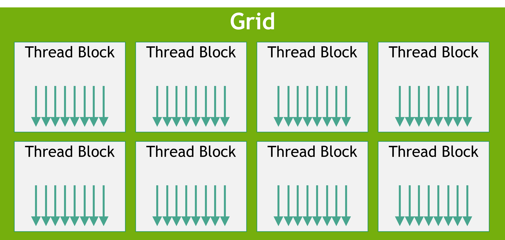
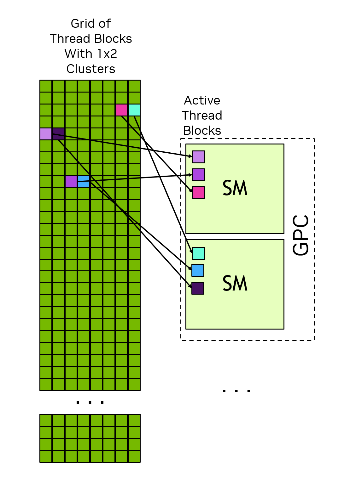

+++
date = '2026-02-09T10:19:07+08:00'
draft = false
title = 'CUDA Programming Guide Notes 1'
tags = ['CUDA']
toc = true
series = ["CUDA Programming Guide Notes"]
+++

> 原文地址：https://docs.nvidia.com/cuda/cuda-programming-guide/01-introduction/programming-model.html

## CUDA编程模型

### 1. 异构系统

CUDA 编程模型假设一个异构计算系统（heterogeneous computing system），即同时包含 GPU 和 CPU 的系统。CPU 及其直接相连的内存称为主机（host）和主机内存（host memory）；GPU 及其直接相连的内存称为设备（device）和设备内存（device memory）。在某些片上系统（SoC）中，两者可能是同一个封装的一部分；在更大的系统中，则可能存在多个 CPU 或 GPU。

CUDA 应用程序把一部分代码放到 GPU 上执行，但程序总是从 CPU 开始运行。主机代码（host code，即运行在 CPU 上的代码）可以用 CUDA API 在主机内存和设备内存之间拷贝数据、在 GPU 上启动代码执行，并等待数据拷贝或 GPU 代码完成。CPU 和 GPU 可以同时执行代码；通常，最大化 CPU 和 GPU 两者的利用率才能获得最佳性能。

在 GPU 上执行的代码称为设备代码（device code），而为了在 GPU 上执行而被调用的函数，出于历史原因称为核函数（kernel）。让一个核函数开始运行的行为称为启动核函数（launching the kernel）。可以认为，一次核函数启动就是在 GPU 上并行地启动大量执行核函数代码的线程。GPU 线程的工作方式与 CPU 线程类似，但在正确性和性能上存在一些重要差异，这些差异将在后续章节中介绍（见第 3.2.2.1.1 节）。

### 2. 线程块和网格

当程序启动一个核函数时，会牵涉大量线程，常常多达数百万个。这些线程被组织成块，称为线程块（thread block）；线程块再组织成网格（grid）。一个网格中所有线程块的大小和维度都相同。

线程块和网格都可以是 1 维、2 维或 3 维的。这些维度可以简化把单个线程映射到工作单元或数据项的过程。

启动核函数时，需要使用特定的执行配置（execution configuration）来指定网格和线程块的维度。执行配置还可以包含一些可选参数，如簇（cluster）大小、流（stream）以及 SM 配置设置，这些将在后续章节介绍。

借助内置变量，每个执行核函数的线程都能确定：

- 自身在所属线程块中的位置
- 所属线程块在网格中的位置
- 线程块与网格的维度

这给了每个线程在所有运行该核函数的线程中唯一的身份；这个身份常用于决定该线程负责处理哪些数据或执行哪些操作。

一个线程块中的所有线程都由单个 SM 执行，因此线程块内的线程可以高效地相互通信和同步。线程块内所有线程都能访问片上共享内存（on-chip shared memory），用于在线程块内的线程之间交换信息。

一个网格可能由数百万个线程块组成，**而执行该网格的 GPU 可能只有数十个或数百个 SM（流式多处理器）**。一个线程块的所有线程都由同一个 SM 执行，并且在大多数情况下 [^1] 会一直运行到完成。线程块之间的调度没有任何保证，因此一个线程块不能依赖其他线程块的结果——那些线程块可能要等当前线程块完成后才被调度。图 4 展示了网格中的线程块如何被分配到 SM 上。

CUDA 编程模型让任意大小的网格都能在任何规模的 GPU 上运行，无论它只有一个 SM 还是数千个 SM。为此，CUDA 编程模型（除少数例外）要求不同线程块中的线程之间不存在数据依赖：一个线程不应依赖同一网格中其他线程块里某个线程的结果，也不应与之同步。一个线程块内的所有线程同时运行在同一个 SM 上；网格中的不同线程块会被调度到可用的 SM 上，并且可以按任意顺序执行。简而言之，CUDA 编程模型要求线程块必须能以任意顺序执行——无论是并行还是串行。

### 3. 线程块Clusters（集群、簇）

此外，计算能力（compute capability）9.0 及更高版本的 GPU 还支持一个可选的分组层级——簇（cluster）。簇是一组线程块的集合，和线程块、网格类似，簇也可以按 1 维、2 维或 3 维布局。图 5 展示了一个同时按簇组织的线程块网格。指定簇不会改变网格的维度，也不会改变线程块在网格中的索引。

> 就是一些高版本的 CUDA 支持在一个网格当中，把线程块分了个组

指定簇会把相邻的线程块分组到一起，并在簇层级提供额外的同步与通信机会。具体来说，一个簇中的所有线程块都在同一个 GPC（Graphics Processing Cluster，图形处理簇）中执行。图 6 展示了指定簇后，线程块如何被调度到 GPC 内的 SM 上。因为这些线程块是同时调度的、且位于同一个 GPC 内，所以位于同一簇中但属于不同线程块的线程，可以通过 Cooperative Groups 提供的软件接口相互通信和同步。簇内的线程还能访问该簇所有线程块的共享内存，这称为分布式共享内存（distributed shared memory）。簇的最大尺寸取决于硬件，不同设备之间有所不同。

> 就是一个簇里面的线程块可以共享资源：共享内存、相互通信、可以同步

### 4. Warps和SIMT

在线程块内部，线程按每 32 个一组被组织成线程束（warp）。线程束以单指令多线程（SIMT，Single-Instruction, Multiple-Threads）范式执行核函数代码。在 SIMT 模式下，线程束中的所有线程执行同一份核函数代码，但每个线程可以走不同的分支。也就是说，虽然程序的所有线程执行相同的代码，但各个线程不必遵循相同的执行路径。

线程由线程束执行时，会被分配一个线程束通道（warp lane）。线程束通道编号为 0 到 31，线程块中的线程按照《硬件多线程》一章所述的确定方式分配到各线程束。

线程束中的所有线程同时执行同一条指令。如果线程束内部分线程遵循某个控制流分支而其余不遵循，那么不遵循的线程会被屏蔽（masked off），只有遵循的线程继续执行。例如，当某个条件只对线程束中一半的线程为真时，另一半就会被屏蔽，活跃的线程执行这些指令（如图 7 所示）。当线程束中的不同线程走不同代码路径时，这种现象称为线程束分化（warp divergence）。因此，当线程束内所有线程遵循相同的控制流路径时，GPU 的利用率最高。

在 SIMT 模型中，线程束中的所有线程以锁步（lock-step）方式在核函数中推进，硬件实际执行可能有所不同。关于这一区别在哪些情况下重要，参见《独立线程执行》一章。不建议利用线程束执行如何映射到真实硬件的知识。CUDA 编程模型和 SIMT 约定，线程束中的所有线程一起在代码中推进；只要遵循编程模型，硬件可以以对程序透明的方式优化被屏蔽的通道。如果程序违反这一模型，可能导致未定义行为，且这种行为在不同 GPU 硬件上可能不同。

线程束执行的一个推论是：线程块最好把线程总数设为 32 的倍数。使用任意数量的线程都是合法的，但当总数不是 32 的倍数时，线程块的最后一个线程束在整个执行过程中会有一些通道闲置，这可能导致该线程束的功能单元利用率下降、内存访问性能不佳。

### 5. Tile Programming（分块编程）

在 SIMT 之外，CUDA 还支持一种**分块编程（tile programming）**模型。在分块编程中，程序员以整个线程块为单位编写代码，描述对多维数据集合——**分块（tile）**——的操作，由编译器把这些操作映射到块内的各个线程上。

分块核函数同样按线程块网格启动（见"线程块和网格"一节）：每个块执行分块核函数，并能查询自己在网格中的位置，从而确定自己负责哪部分数据。程序员只需指定网格维度；**每个块内的线程数由编译器根据核函数中的分块操作决定**（图 8）。在 SIMT 中，程序员写的是逐线程代码、手动控制每个线程如何访问数据；在分块编程中，程序员写的是整块代码、操作分块，编译器负责把操作分配到线程。

在分块核函数内，块遵循**单一控制流**：程序员描述对分块的操作，编译器把工作分配给块内所有线程。条件、循环等常规控制流都支持，但因为块只有一个控制流，**不存在线程束分化**的概念。标量操作（如计算索引或循环边界）由块中的单个线程执行；分块操作（如两个分块逐元素相加）则由块内所有线程并行地集体执行。

> 注意别混淆"块（block）"和"分块（tile）"：块是执行单元，分块是数据单元。单个块可以创建并操作许多形状、类型各异的分块。

#### 5.1 数组与分块

分块核函数处理两类数据：**数组（array）**和**分块（tile）**。

- **数组**（也叫全局数组）是存储在设备内存中的多维元素容器。数组是可变的：核函数中的 store 操作可以修改其内容。数组有形状（shape）和数据类型。
- **分块**是只存在于分块代码中的多维值集合，**只属于单个块**。分块不可变：对分块的每个操作都产生一个新分块，而不是修改现有分块。与数组不同，分块不一定在内存中有实际表示——编译器决定如何存储分块数据，可能用寄存器、共享内存或 SM 的其他资源。分块的每个维度都必须是 2 的幂，且必须在编译期确定。分块不能作为核函数参数传递，只能在分块代码内部创建和消费。

#### 5.2 分块空间与数据移动

数据通过 **load / store 操作**在数组和分块之间流动，这些操作依赖一个概念——**分块空间（tile space）**：把数组在概念上划分成大小相等、互不重叠的分块网格。例如，一个形状为 (M, N) 的二维数组，若 load 操作指定分块形状 (tm, tn)，数组就被概念性地分成 ⌈M/tm⌉ 行 × ⌈N/tn⌉ 列分块；用分块空间中的索引 (i, j) 即可指定要加载哪个分块，load 返回包含对应元素的 (tm, tn) 分块。当分块越出数组边界时（例如数组维度不是分块维度的整数倍），load 需要说明如何处理越界元素，比如补零（图 9）。

store 操作则相反：给定一个分块和分块空间索引，把它写回数组的对应区域；越界的写入会被静默丢弃。分块程序还支持 gather / scatter 操作，从数组任意位置加载或写入。

#### 5.3 对分块的操作

分块程序提供一组内置操作：逐元素算术、矩阵乘法、沿一个或多个轴的归约（如求和、求最大值）、形状变换（如 reshape、transpose）、类型转换等。当两个形状不同的分块参与运算时，较小的分块会自动扩展成与较大者一致后再执行操作。

#### 5.4 与 SIMT 编程的关系

分块编程和 SIMT 编程在 CUDA 中并存：一个应用程序可以同时包含 SIMT 核函数和分块核函数，两者可以操作设备内存中的同一份数据；选择哪种模型是**每个核函数各自的决定**。分块编程并不取代 SIMT——SIMT 提供对单个线程的细粒度控制，对某些算法和优化技巧仍然必要；分块编程提供更高层的抽象，能简化核函数开发。由于线程级决策交给编译器，同一个分块核函数可以不经改动地运行在不同 GPU 架构上。两种模型都构建在同样的底层硬件（SM、线程块、网格）之上，也使用同样的设备内存空间（将在下一节介绍）。

### 6. 异构系统中的DRAM内存

GPU 和 CPU 都直接连接着 DRAM 芯片；在拥有多个 GPU 的系统中，每个 GPU 都有自己的内存。从设备代码的角度看，连接到 GPU 的 DRAM 称为**全局内存（global memory）**，因为它可被 GPU 中所有 SM 访问（但 CPU 不能直接访问）。这个术语并不意味着它在系统任何地方都可访问。连接到 CPU 的 DRAM 则称为**系统内存（system memory）**或**主机内存（host memory）**。

与 CPU 类似，GPU 也使用虚拟内存寻址。在所有当前支持的系统中，CPU 和 GPU 共享**单一的统一虚拟内存空间**（即同一个虚拟地址空间）。这意味着系统中每个 GPU 的虚拟内存地址范围都是唯一的，与 CPU 和其他 GPU 的地址范围互不重叠。给定一个虚拟地址，就能确定它落在 GPU 内存还是系统内存中；在多 GPU 系统中，还能确定它属于哪一块 GPU 内存。

CUDA 提供了分配 GPU 内存、CPU 内存的 API，以及用于在 CPU 与 GPU 之间、单个 GPU 内部或多个 GPU 之间拷贝数据的 API。需要时，可以显式控制数据的位置。下文讨论的**统一内存（Unified Memory）**则允许把内存放置交给 CUDA 运行时或系统硬件自动处理。

| 概念             | 说明                                             |
| :--------------- | :----------------------------------------------- |
| 物理内存独立     | CPU、GPU 0、 GPU 1、各有自己的DRAM               |
| Global Memory    | GPU内全局（所有SM可访问），非系统全局            |
| 统一虚拟地址内存 | CPU和所有GPU共享同一个虚拟地址空间，地址范围唯一 |
| 显式控制         | 使用`cudaMalloc`和`cudaMemcpy`手动管理数据位置   |
| 统一内存         | 使用`cudaMallocManaged`自动管理数据迁移          |

### 7. GPU的片上内存

除了全局内存之外，每个 GPU 还有一些**片上内存（on-chip memory）**。每个 SM 都有自己的一组**寄存器堆（register file）**和**共享内存（shared memory）**。这些内存属于 SM 的一部分，在该 SM 内执行的线程能以极快的速度访问，但其他 SM 上运行的线程无法访问。

寄存器堆存放线程局部变量（thread-local variables），通常由编译器分配。共享内存可被线程块或簇内的所有线程访问，用于线程块或簇内线程之间的数据交换。

这两段话并不矛盾。先理清线程块和 SM 的关系：

- 规则 1：一个线程块的所有线程由单个 SM 执行
- 规则 2：一个线程块不会跨多个 SM 执行
- 规则 3：一个 SM 可以同时执行多个线程块（如果资源足够）

根据这些规则，"线程块内共享内存可被线程共享"就很好理解了：因为规则 2，一个线程块不会跨 SM，其线程自然都在同一个 SM 内，所以能共享该 SM 的共享内存。

但"SM 的共享内存可被簇内所有线程访问"就有点令人疑惑：簇包含多个线程块，而这些线程块虽然都在同一个 GPC 中执行，但一个 GPC 里有多个 SM——簇内线程访问共享内存，岂不就是跨 SM 共享了？

原因在于，簇提供了软件接口和硬件支持，使不同线程块（可能位于不同 SM 上）中的线程能够相互通信和同步：

- 软件接口：CUDA 提供了 Cooperative Groups API
- 硬件支持：GPC 内部有特殊的互连硬件，允许 SM 之间快速访问彼此的共享内存

SM 的寄存器堆和统一数据缓存（unified data cache）容量有限。一个 SM 的寄存器堆大小、统一数据缓存大小，以及统一数据缓存在 L1 缓存和共享内存之间如何配置，可在《每个计算能力的内存信息》中查到。寄存器堆、共享内存空间和 L1 缓存在线程块的所有线程之间共享。

要把线程块调度到 SM 上，每个线程所需的寄存器数乘以线程块中的线程数，必须小于等于 SM 中可用的寄存器数。如果线程块所需的寄存器数超过寄存器堆容量，核函数将无法启动，必须减少线程块中的线程数才能让它可启动。

共享内存的分配以线程块为单位：与按线程分配的寄存器不同，共享内存的分配对整个线程块共用。

### 8. 缓存

除了可编程内存之外，GPU 还有 L1 和 L2 缓存。每个 SM 都有一个 L1 缓存，它是统一数据缓存的一部分；更大的 L2 缓存由 GPU 内所有 SM 共享（见图 2 的 GPU 框图）。每个 SM 还有一个独立的常量缓存（constant cache），用于缓存那些在核函数整个生命周期内被声明为常量的全局内存值。编译器也可能把核函数参数放进常量内存。这样核函数参数可以独立于 L1 数据缓存在 SM 中被缓存，从而提升核函数性能。

### 9. 统一内存

当应用程序在 GPU 或 CPU 上显式分配内存时，该内存只能由运行在该设备上的代码访问：CPU 内存只能由 CPU 代码访问，GPU 内存只能由在 GPU 上运行的核函数访问 [^2]。用于在 CPU 和 GPU 之间拷贝内存的 CUDA API，就是用来在正确的时间把数据显式拷到正确的内存中。

CUDA 的统一内存（unified memory）特性允许应用程序做这样的内存分配：CPU 或 GPU 都能访问。CUDA 运行时或底层硬件会在需要时启用访问权限，或把数据重定位到正确的位置。即使使用统一内存，要获得最佳性能，也应尽量减少内存迁移，并尽可能从直接连接该内存的处理器访问数据。

系统的硬件特性决定了内存空间之间的访问和交换如何实现。《统一内存》一章介绍了不同类别的统一内存系统，并对统一内存在各种场景下的使用和行为给出了更多细节。

[^1]: 在某些情况下（如使用 CUDA 动态并行（CUDA Dynamic Parallelism）时），线程块可能被挂起到内存：SM 的状态被保存到 GPU 内存中系统管理的区域，SM 腾出来执行其他线程块。这类似于 CPU 的上下文切换，但并不常见。

[^2]: 一个例外是映射内存（mapped memory）：以特定属性分配的 CPU 内存可直接被 GPU 访问。不过这种映射访问要经过 PCIe 或 NVLINK，GPU 无法用并行性掩盖其更高的延迟和更低的带宽，因此映射内存并不能高效替代统一内存，也不能替代把数据放到合适的内存空间。
